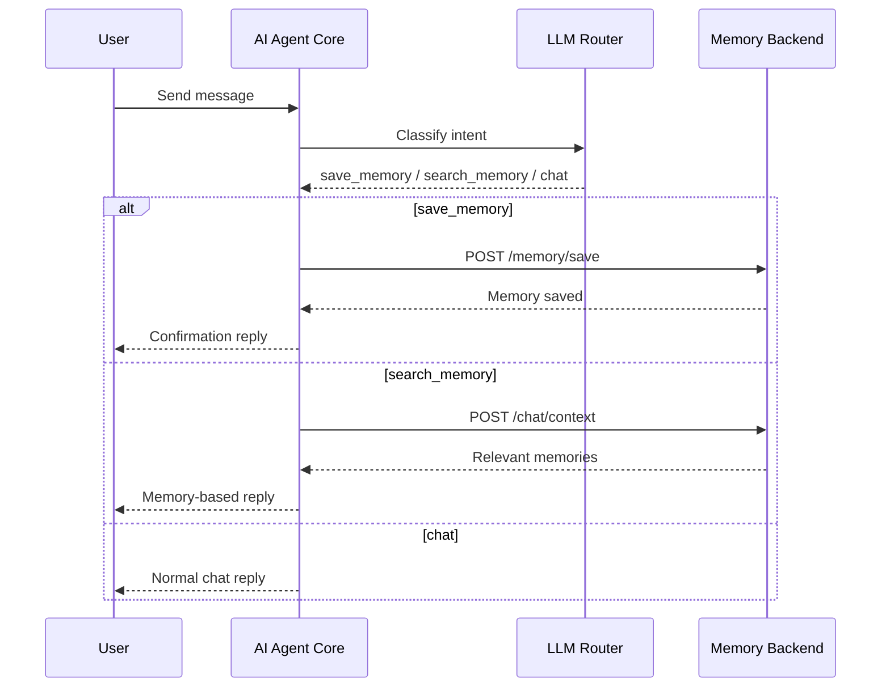

# AI Agent Core

A minimal, production-style agent layer for AI systems.

This service acts as the decision-making brain between user input and backend tools like memory, APIs, or external services.

---

## What It Does

The agent:

- Understands user intent
- Decides what action to take
- Calls the appropriate tool (memory, etc.)
- Returns a structured response

---

## Architecture

```
User Input
   ↓
LLM Intent Routing
   ↓
AI Agent Core
   ↓
Memory Backend / Tools
   ↓
Structured Response
```

---

## Features

- LLM-powered intent classification with rule-based fallback (save, search, chat)
- Memory tool integration
- Topic normalization
- Structured agent responses
- FastAPI-based API

---

## API

### POST `/agent/respond`

Send a message and let the agent decide what to do.

#### Request

```json
{
  "user_id": "user_123",
  "message": "My favorite food is sushi"
}
```

#### Response

```json
{
  "decision": {
    "intent": "save_memory",
    "reason": "The message looks like a durable fact or preference worth storing.",
    "topic": "preferences"
  },
  "reply": "Got it — I saved that to memory."
}
```

---

## Quick Start

```bash
git clone <your-repo>
cd ai-agent-core

python3 -m venv venv
source venv/bin/activate

pip install -r requirements.txt
python -m uvicorn agent:app --reload --port 8001
```

Open:
http://127.0.0.1:8001/docs

---

## Requirements

This agent is designed to work with a memory backend.

By default, it connects to:

```
http://127.0.0.1:8000
```

You can change this using an environment variable:

```env
MEMORY_API_BASE=http://your-backend-url
```
```
OPENAI_API_KEY=your_api_key_here
OPENAI_MODEL=gpt-4.1-mini
```

---

## Example Flows

### Save Memory

Input:
> "My favorite gym is Lifetime Fitness"

Agent:
- Detects memory intent
- Calls memory API
- Confirms save

---

### Search Memory

Input:
> "Where do I work out?"

Agent:
- Searches memory
- Returns relevant result

---

## Use Cases

- AI assistants with tool use
- Memory-aware chat systems
- Agent-based AI architectures
- Rapid prototyping of AI workflows

---

## Request Flow

```text
User Message
   ↓
LLM Intent Router
   ↓
Decision
   ├─ save_memory   → Memory Backend: /memory/save
   ├─ search_memory → Memory Backend: /chat/context
   └─ chat          → Direct response
   ↓
Structured Agent Response
```

---

## Sequence Diagram



---

## Example Trace

### Input

```json
{
  "user_id": "adam",
  "message": "What do I like to eat?"
}
```

### Step 1: LLM Intent Classification

```json
{
  "intent": "search_memory",
  "reason": "The user is asking for a previously stored preference.",
  "topic": "preferences"
}
```

### Step 2: Tool Call

```
POST /chat/context
```

### Step 3: Memory Backend Response

```json
{
  "memories": [
    {
      "content": "My favorite food is sushi"
    }
  ],
  "context_block": "Relevant memories:\n- [preferences] My favorite food is sushi"
}
```

### Step 4: Final Agent Response

```json
{
  "reply": "Here’s what I found in memory: My favorite food is sushi"
}
```

---

## LLM Intent Routing

The agent uses a language model to classify user intent into one of:

- save_memory
- search_memory
- chat

The model returns structured JSON, which is validated before execution.

If the model fails or is unavailable, the agent falls back to a rule-based classifier.

---

## Notes

- Uses LLM-based intent routing with a rule-based fallback for reliability
- Designed to be simple and extensible
- Plug into voice, chat, or mobile apps

---
## Support

If this project was useful, consider starring the repository.

## Related Projects

- realtime-voice-ai — real-time voice interface for AI systems
- ai-memory-backend — persistent memory layer for AI